# Manual do Usuário - TraderLogPro

Este manual irá guiá-frame por página sobre a utilização do sistema, desde os primeiros passos até as ferramentas mais avançadas de controle e análises fiscais do **TraderLog Pro**.

---

## 1. Setup Engine (Instalação Inicial)

Ao abrir o TraderLog Pro pela primeira vez, o aplicativo identifica que é uma instalação fresca e inicia automaticamente o **Setup Engine**, nosso assistente de configuração em 9 passos.

### Passo 1: Boas-vindas e Preferências Visuais

A primeira tela garante que o ambiente esteja confortável para a sua leitura. 

**O que fazer nesta etapa:**
- **Selecione seu Idioma:** Você deve escolher o idioma da interface. As opções atuais incluem Português (BR), English, Español e Français. O clique altera instantaneamente todos os rótulos do aplicativo.
- **Selecione o Tema Visual:** Escolha entre **Dark (Noite)**, que é o padrão recomendado para reduzir o cansaço visual de quem acompanha telas por muitas horas, ou **Light (Dia)**.
- **Botão Próximo:** Após fazer as duas escolhas, basta clicar no botão inferior direito para avançar.

---

## Passo 2: Criação de Perfil Local e Segurança

Uma vez definido o seu idioma, a próxima tela solicitará a criação do seu perfil de usuário primário no TraderLog Pro.

Esta etapa é crucial pois ela define quem é o administrador deste ambiente de trabalho.

**O que você precisa preencher:**
- **Nome:** Como você gostaria de ser chamado no sistema.
- **E-mail:** Seu e-mail de contato principal.
- **Senha e Confirmação (Importante):** O TraderLog Pro opera localmente. Esta senha serve para criptografar seus dados e impedir acessos não autorizados de pessoas que usam o mesmo computador que você. 
   - *Atenção:* Como não enviamos seus dados para a nuvem, se você esquecer essa senha, dependerá exclusivamente da sua Chave de Recuperação (gerada no passo seguinte) para não perder o acesso ao seu diário de trades.

Preencha os dados e clique em avançar.

---

## Passo 3: Chave de Recuperação (Master Key)

Após definir sua senha, o sistema irá gerar automaticamente uma **Chave Mestra de Recuperação**. 

Esta tela possui um grande alerta vermelho por um motivo muito importante: **você não deve ignorar esta etapa.**

- **O que é a Chave de Recuperação?** É um código único associado ao seu perfil. Se você esquecer a senha criada no passo anterior, este código será a *ÚNICA FORMA* de restaurar o acesso aos seus dados no TraderLog Pro.
- **Como guardar:** Clique sobre o bloco que exibe a chave para copiá-la automaticamente para a área de transferência. Salve este código em um local **seguro e externo** ao seu computador (ex: um gerenciador de senhas como 1Password ou anotado em um papel).
- **Aviso de Segurança:** Nunca compartilhe esta chave com terceiros. O suporte técnico do TraderLog Pro nunca solicitará esta chave.

Após garantir que a chave foi salva de forma segura, você pode prosseguir.

---

## Passo 4: Ativação de Licença

Com o seu perfil criado e a chave mestra salva, o TraderLog Pro solicitará a ativação da sua licença.

**Nesta tela você pode:**
- **Importar Licença:** Se você já adquiriu o TraderLog Pro, clique no botão para selecionar o seu arquivo de licença (.lic) recebido por e-mail.
- **Modo Trial (Pular):** Caso queira apenas testar o sistema, você pode pular esta etapa e validá-la posteriormente nas configurações.

---

## Passo 5: Seleção de Moeda Base

Aqui você define a moeda principal que o sistema usará para calcular seus totais consolidados no Dashboard.

**Opções disponíveis:**
- **BRL (Real):** Recomendado para traders brasileiros que operam na B3.
- **USD (Dólar):** Ideal para quem foca exclusivamente no mercado americano.
- **USDT:** Para traders de criptomoedas.

*Nota: Você pode adicionar outras moedas secundárias depois, mas esta será a sua referência principal.*

---

## Passo 6: Mercados de Atuação

O TraderLog Pro é um sistema multimerclado. Nesta etapa, você informa ao assistente quais mercados você costuma operar para que ele prepare os calendários e fusos horários corretos.

**Como configurar:**
- Selecione um ou mais mercados (ex: B3 Brasil, NYSE, NASDAQ, Cripto).
- O sistema ajustará automaticamente o fuso horário (Timezone) para as importações de notas de corretagem.

---

## Passo 7: Tipos de Ativos

Com base nos mercados selecionados no passo anterior, você filtrará aqui quais tipos de ativos (Assets) você deseja que o assistente monitore.

**Exemplos:**
- **Ações:** Para operações clássicas de Buy & Hold ou Day/Swing Trade.
- **Opções:** Se você opera derivativos.
- **Futuros:** Para quem opera contratos de Índice (WIN) ou Dólar (WDO) na B3.

---

## Passo 8: Conexão Real-Time (RTD)

Este é um diferencial do TraderLog Pro. Você pode conectar sua plataforma de negociação (ex: Profit) para que o sistema receba cotações e execuções em tempo real.

**Como funciona:**
- O sistema utiliza uma integração via Excel/RTD para "ouvir" sua plataforma.
- **Ativar agora:** Siga as instruções na tela para baixar o assistente de conexão.
- **Pular:** Você pode configurar isso a qualquer momento no menu de Configurações do sistema.

---

## Passo 9: Finalização (Missão Pronta!)

Parabéns! Você concluiu a configuração de base do seu assistente de trading.

Ao clicar em **"INICIAR JORNADA"**, o TraderLog Pro salvará suas preferências locais e abrirá o Dashboard principal. Caso precise alterar qualquer informação que inseriu aqui, tudo estará disponível no menu lateral de configurações.

---

# Parte 2: Navegação e Interface

## Visão Geral do Dashboard (Painel)

O Dashboard (identificado como **Painel** no menu lateral) é a central de comando do TraderLog Pro. Aqui você tem uma visão panorâmica e em tempo real da sua performance.

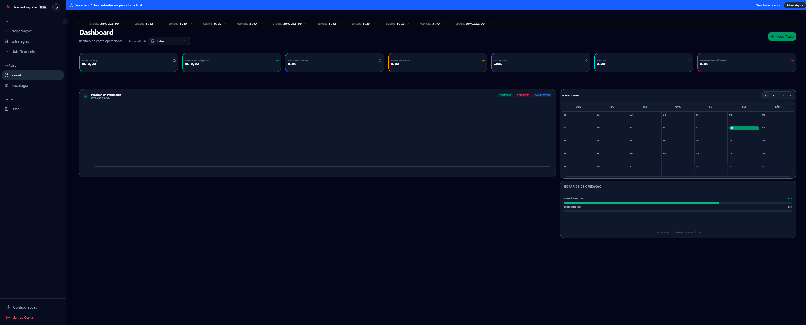

### Elementos Principais:
1.  **Sidebar (Menu Lateral):** Onde você acessa todos os módulos do sistema.
2.  **Ticker de Cotações:** Fita superior com preços de ativos e moedas em tempo real.
3.  **Kash Cards (Indicadores de Topo):**
    - **Saldo Est.:** Patrimônio líquido estimado.
    - **Resultado Líquido:** Lucro ou prejuízo do período selecionado.
    - **Taxa de Acerto & Profit Factor:** Métricas cruciais de eficiência.
    - **Disciplina:** Medidor de obediência às suas regras de trading.
4.  **Gráficos de Evolução:** Visualização do crescimento do seu patrimônio.
5.  **Calendário de Performance:** Visualização mensal colorida (verde/vermelho) dos seus resultados.

---

## Menu de Navegação Lateral

A sidebar é dividida em seções lógicas para facilitar o seu dia a dia:

### Início
- **Painel:** Retorna à visão geral (Dashboard).
- **Negociações:** Onde você gerencia suas ordens, histórico e diário de trade.
- **Estratégias:** Cadastro e análise de setups.
- **Psicologia:** Ferramentas para controle emocional (Auto-Journaling).

### Análise & Dados
- **Hub Financeiro:** Gestão de contas bancárias, corretoras e transferências.
- **Ativos:** Lista de ativos monitorados e cotações.

### Fiscal
- **Fiscal:** Todo o motor de cálculo de impostos, controle de prejuízos acumulados e geração de DARF.

### Sistema (Base)
- **Configurações:** (Ícone de engrenagem) Ajustes de perfil, licenciamento, temas e conexões RTD.
- **Sair:** Encerra a sessão local com segurança.

---
*(Fim da Seção: Dashboard e Navegação)*

---

# Parte 3: Módulos Principais

## Negociações (Trades)

Este é o módulo central do TraderLog Pro. Aqui fica todo o seu histórico de operações, organizado de forma hierárquica.

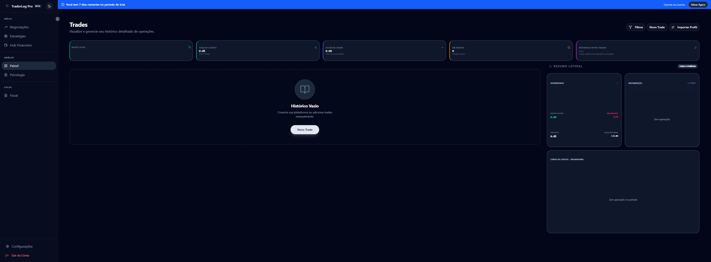

### Estrutura da Página
O histórico é organizado em:
- **Mês → Semana → Dia → Operação**
- Cada nível exibe o P&L consolidado do período.

### KPIs (Painel de Métricas)
Na parte superior da página, você tem acesso rápido a:

| Métrica | Descrição |
|---|---|
| **Saldo Total** | Resultado financeiro total (P&L) de todas as operações filtradas. |
| **Total de Trades** | Contagem total de operações no período. |
| **Taxa de Acerto** | Percentual de operações lucrativas. |
| **Profit Factor** | Razão entre o lucro bruto e o prejuízo bruto. |
| **Tempo Médio** | Intervalo médio entre as operações. |

### Ações Principais
- **⊕ Novo Trade:** Abre o assistente para registro manual de uma nova operação.
- **Importar Profit:** Importa o extrato de operações diretamente de um arquivo `.csv` exportado pela plataforma Profit.
- **Filtrar:** Filtra as operações por status (aberto/fechado), conta, estratégia, tipo de ativo ou moeda.

---

## Estratégias

O módulo de Estratégias é onde você cadastra os seus setups operacionais (ex: "Rompimento de Abertura", "Lã com Lã"). Vincular um setup a cada trade é fundamental para avaliar qual estratégia dá mais retorno.

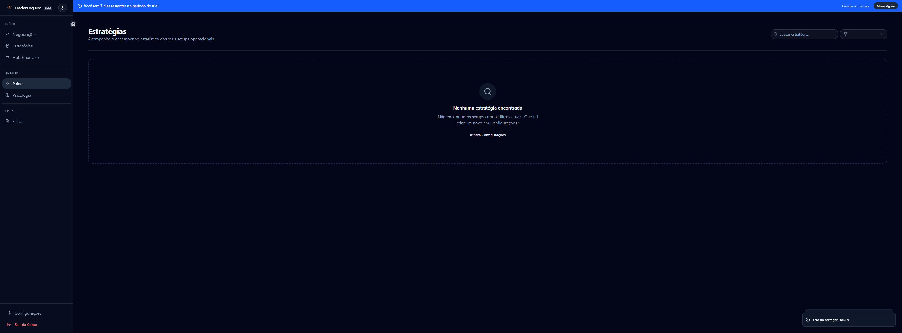

- **Nova Estratégia:** Cadastre o nome, descrição, e regras do setup.
- **Desempenho:** Veja estatísticas de win rate e P&L por estratégia.

---

## Psicologia (Auto-Journaling)

A página de Psicologia é um diferencial do TraderLog Pro. Ela exibe os registros de estado emocional que você faz após cada operação.

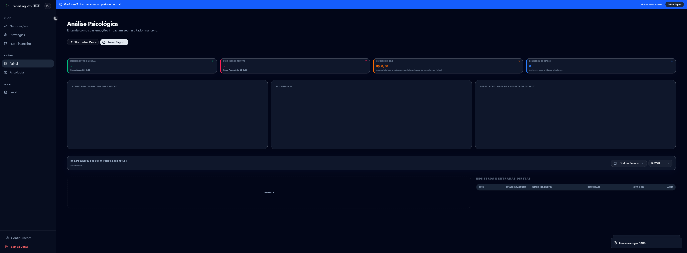

**Como funciona:**
- Após registrar ou importar um trade, o sistema pode exibir um pop-up pedindo que você avalie seu estado emocional (Calmo, Ansioso, Disciplinado, etc.).
- Os dados coletados aqui alimentam gráficos de performance emocional, ajudando a identificar padrões comportamentais que impactam seus resultados.

---

## Hub Financeiro

O Hub Financeiro é a gestão financeira extratógica do TraderLog Pro. É onde você controla o dinheiro que flui pelas suas contas.

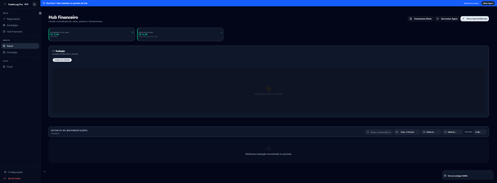

**Funcionalidades:**
- **Fechamento Diário:** O sistema pode gerar um fechamento automático ao final do dia de pregão, consolidando o resultado das operações em uma entrada de extrato.
- **Transferências:** Movimentação de valores entre contas.

---

## Fiscal (DARF & IRPF)

Este módulo é o coelho do chapeu do TraderLog Pro para traders brasileiros. Ele calcula automaticamente os impostos devidos conforme as regras da Receita Federal.

#### Vista Mensal (Paínel Fiscal)
- Resumo mensal do resultado líquido por mercado (B3, Exterior, etc.).
- Identifica automaticamente quando há isenckão (ex: vendas abaixo de R$ 20.000 para ações em Swing Trade).
- Exibe o valor do DARF a pagar por mês e por DARF.

#### IRPF (Imposto de Renda)
- Gera os dados consolidados para declaração anual (preço médio, ganhos/perdas por ativo).

#### DARF (Por Código de Receita)
- Lista os DARFs gerados com os respectivos códigos de receita (ex: 6015, 6006).
- Informa o valor exato a pagar e o vencimento (último dia útil do mês seguinte).

---

# Parte 4: Configurações do Sistema

## Visão Geral das Configurações

A área de Configurações está dividida em seções lógicas para facilitar o gerenciamento. Acesse pelo ícone de engrenagem no rodapé do menu lateral.

---

### GERAL

#### Perfil (`/settings/profile`)

Gerencie suas informações pessoais e de contato. Estes dados são usados para identificar sua conta e podem ser necessários para suporte técnico ou recuperação de acesso.

> [!IMPORTANT]
> **SCREENSHOT MISSING**: Visão do Perfil do Usuário.

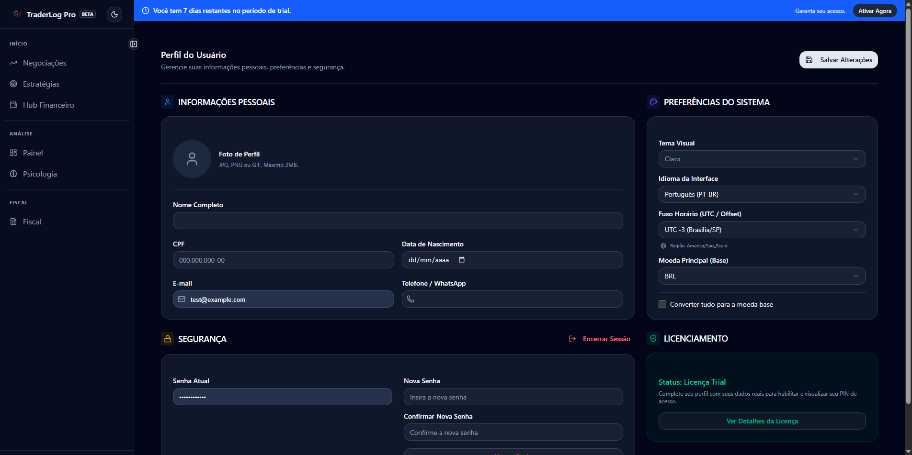

- **Dados Pessoais:** Nome, CPF, Data de Nascimento.
- **Contato:** E-mail e Telefone.
- **Preferências:** Idioma da interface e Fuso Horário local.

#### Licença (`/settings/license`)

Acompanhe o status da sua assinatura do TraderLog Pro.

> [!IMPORTANT]
> **SCREENSHOT MISSING**: Tela de Licenciamento.

- **Status:** Indica se a licença está Ativa, Expirada ou em Período de Teste.
- **Validade:** Data de expiração do plano atual.
- **ID do Hardware:** Identificador único do seu computador para vinculação da licença.
- **Importar Licença:** Botão para selecionar o arquivo `.lic` e ativar seu acesso premium.

---

### CADASTROS

#### Contas (`/settings/accounts`)

A página de Contas é onde você cadastra suas corretoras, mesas proprietárias ou simuladores. **O cadastro de pelo menos uma conta é pré-requisito** para registrar qualquer operação no sistema.

A tela principal lista todas as suas contas, organizadas e agrupadas por tipo (Contas Reais, Mesas Proprietárias, Simuladores). Para cada conta, você visualiza rapidamente a corretora, a moeda e o saldo atualizado.

**Criando ou Editando uma Conta**

**Campos do Formulário:**
- **Ícone:** Permite fazer upload de uma imagem personalizada (ex: logo da corretora).
- **Apelido:** Nome curto de identificação (ex: "XP Swing Trade").
- **Tipo de Conta:** `Real`, `Demo` ou `Prop`.
- **Corretora:** Nome da instituição financeira.
- **Número da Conta:** Identificador opcional.
- **Moeda:** A moeda base desta conta específica.
- **Saldo Inicial:** Valor financeiro de partida.

#### Moedas (`/settings/currencies`)

Gerencie as moedas suportadas e defina taxas de câmbio em relação à moeda base.

**Criando ou Editando uma Moeda**

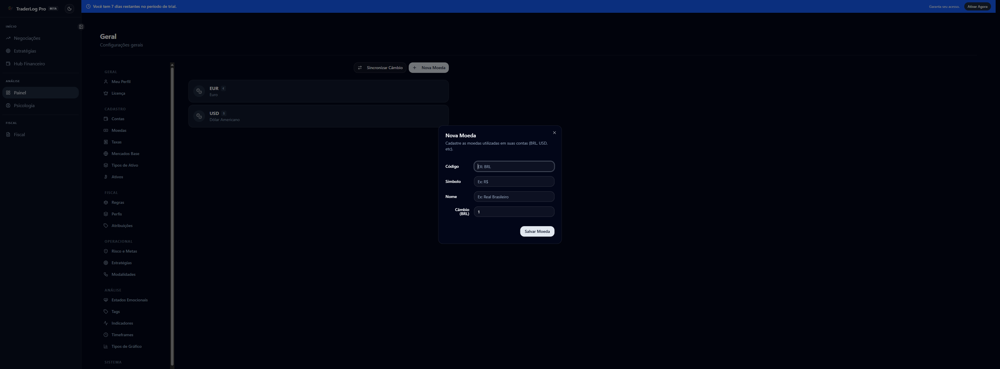

**Campos do Formulário:**
- **Código:** Código internacional (ex: USD, EUR).
- **Símbolo:** Símbolo gráfico (ex: $, €).
- **Nome:** Nome descritivo completo.
- **Câmbio (BRL):** Taxa de conversão contra a moeda principal.

#### Mercados (`/settings/markets`)

Lista dos ambientes de negociação (ex: B3, NYSE). Define fuso horário e horários de pregão.

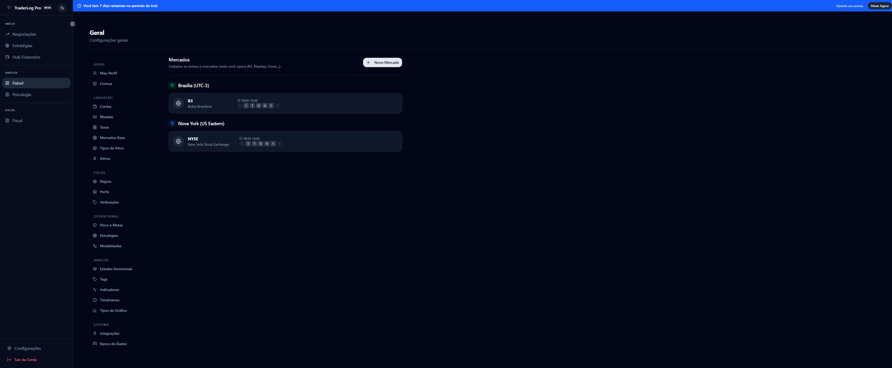

**Criando ou Editando um Mercado**

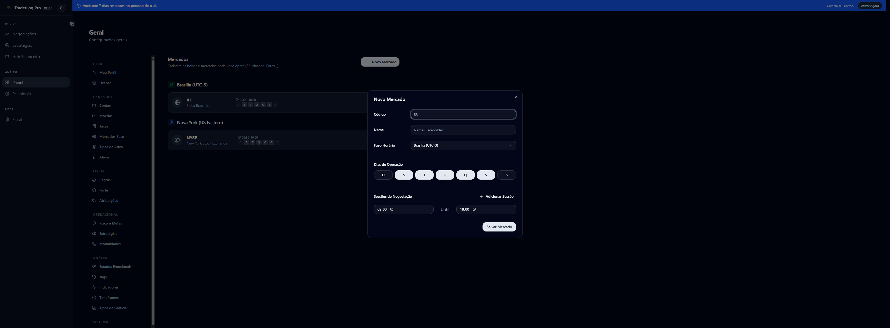

**Campos do Formulário:**
- **Código:** Identificação curta (ex: B3, NYSE).
- **Nome:** Nome completo.
- **Fuso Horário:** Fuso horário oficial da bolsa.
- **Dias de Negociação:** Dias da semana ativos.
- **Sessões de Negociação:** Janelas exatas de pregão.

#### Tipos de Ativos (`/settings/asset-types`)

Categorias principais que agrupam os papéis (ex: Ações, Opções, Futuros).

**Adicionando um Tipo de Ativo**

- **Código:** Identificador curto (ex: FUT, ACAO).
- **Nome:** Nome descritivo.
- **Mercado:** Mercado base correspondente.
- **Unidade:** Rótulo de quantidade (ex: Contratos, Cotas).
- **Tipo de Resultado:** Se o PnL é calculado em **Financeiro** ou **Pontos**.

#### Ativos (`/settings/assets`)

A tela de **Ativos** é onde você cadastra os tickers ou papéis individuais (ex: PETR4, WDOJ24).

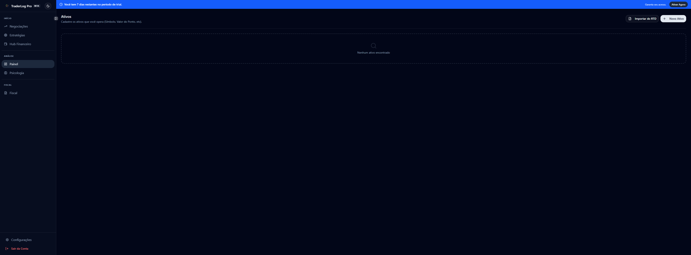

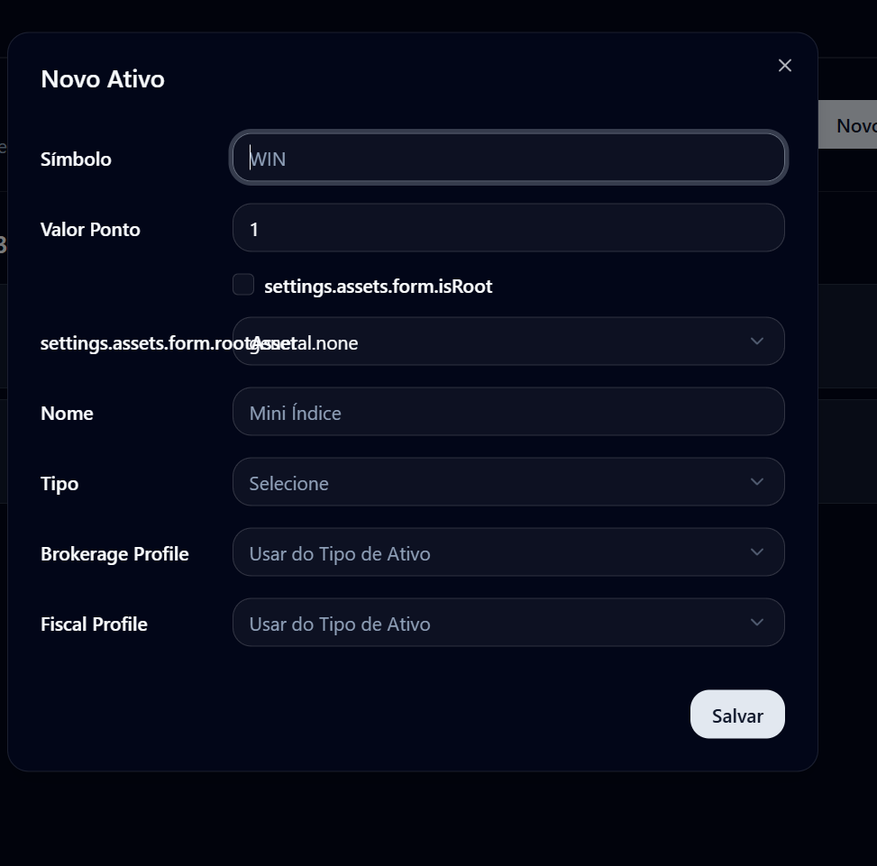

Vincule o papel ao seu **Tipo de Ativo** e defina o **Peso do Ponto** (ex: 0.20 para mini-índice).

#### Taxas & Emolumentos (`/settings/fees`)

Cadastre perfis de custos operacionais (corretagem, ISS, taxas da bolsa).

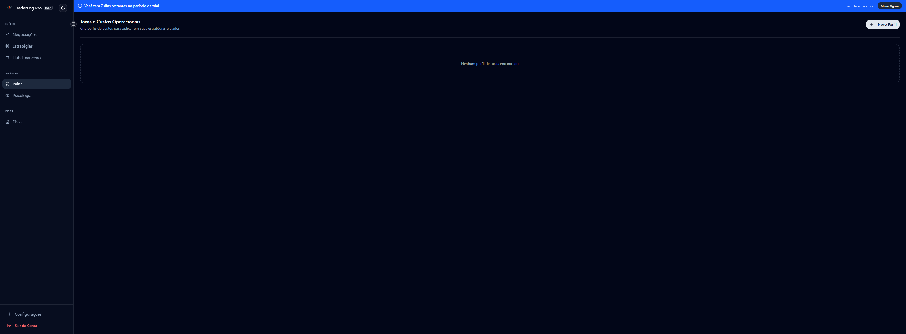

- **Nome:** Nome do perfil.
- **Tipo de Cálculo:** Valor fixo ou percentual.
- **Valores:** Corretagem, Emolumentos, Registro e ISS.

---

### FISCAL

#### Regras Fiscais (`/settings/fiscal/rules`)

As **Regras Fiscais** definem as alíquotas e códigos de receita (DARF) para cada tipo de operação e ativo. 

> [!IMPORTANT]
> **SCREENSHOT MISSING**: Regras Fiscais.

Cada regra especifica:
- **Alíquota:** Porcentagem de imposto (ex: 15% para Swing Trade, 20% para Day Trade).
- **Código DARF:** Código usado para pagamento (ex: 6015).
- **Isenção:** Valor limite de vendas para isenção (ex: R$ 20.000 para ações B3).

#### Perfis Fiscais (`/settings/fiscal/profiles`)

Um **Perfil Fiscal** é um conjunto de Regras Fiscais. Você pode ter um perfil "Padrão Brasil" que contém todas as regras para o mercado nacional.

> [!IMPORTANT]
> **SCREENSHOT MISSING**: Perfis Fiscais.

#### Atribuições (`/settings/fiscal/assignments`)

Nesta tela, você vincula um **Perfil Fiscal** a uma **Conta** ou a um **Tipo de Ativo**. Isso garante que, ao fazer um trade naquela conta, o sistema saiba exatamente qual regra de imposto aplicar.

> [!IMPORTANT]
> **SCREENSHOT MISSING**: Atribuições Fiscais.

---

---

### OPERACIONAL

#### Perfil de Risco (`/settings/risk`)

O seu **Perfil de Risco** é o que define as métricas de disciplina no seu Dashboard. 

> [!IMPORTANT]
> **SCREENSHOT MISSING**: Perfil de Risco.

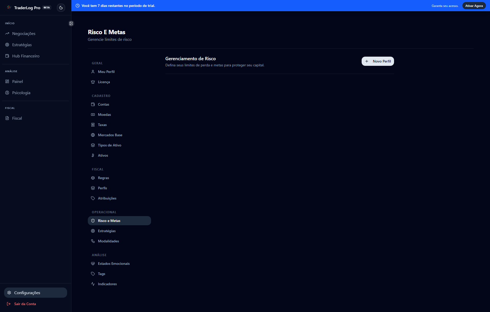

- **Stop Loss Diário:** Valor financeiro máximo que você aceita perder em um dia.
- **Risco por Operação:** Limite de perda por trade.
- **Quantidade Máxima de Contratos/Lotes:** Trava operacional sugerida.

#### Estratégias (`/settings/strategies`)

Cadastre seus setups operacionais para analisar quais trazem os melhores resultados.

> [!IMPORTANT]
> **SCREENSHOT MISSING**: Lista de Estratégias.

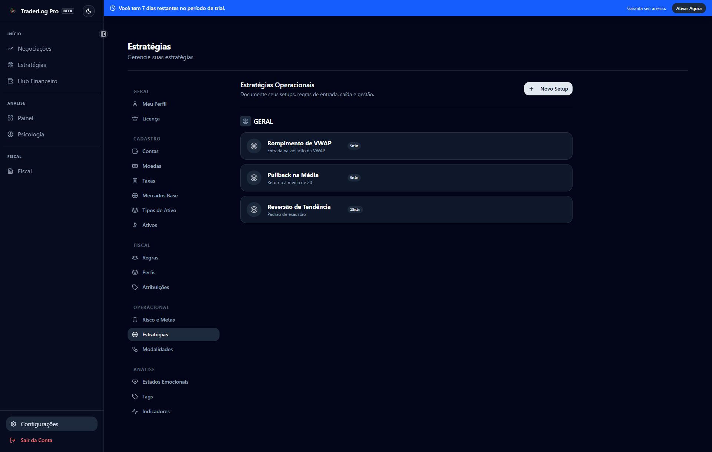

#### Modalidades (`/settings/modalities`)

Defina como você opera temporalmente (ex: Day Trade, Swing Trade, Buy & Hold). Isso afeta agrupamentos em relatórios e regras fiscais.

---

### ANÁLISE

#### Estados Emocionais (`/settings/emotional-states`)

Personalize as emoções que você registra no diário. 

> [!IMPORTANT]
> **SCREENSHOT MISSING**: Estados Emocionais.

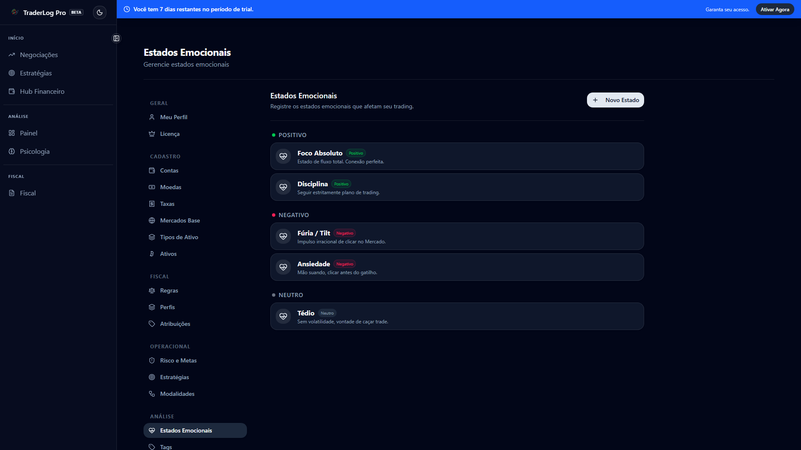

#### Tags (`/settings/tags`)

Etiquetas livres para categorizar comportamentos ou setups específicos (ex: "Vingança", "Error 404", "Setup Perfeito").

#### Indicadores (`/settings/indicators`)

Cadastre os indicadores que você usa em seus gráficos (ex: VWAP, Médias Móveis, IFR).

#### Timeframes (`/settings/timeframes`)

Tempos gráficos utilizados (ex: 5 min, 15 min, Diário).

#### Tipos de Gráfico (`/settings/chart-types`)

Formatos de visualização (ex: Candles, Renko, Heikin-Ashi).

---

### SISTEMA

#### Integrações (`/settings/api-integrations`)

Configure chaves de API para serviços externos, como dados de mercado em tempo real ou integração com ferramentas de psicologia.

#### Banco de Dados (`/settings/database`)

Controle total sobre seus dados locais.

> **SCREENSHOT MISSING**: Gestão de Banco de Dados.

- **Backup:** Gere um arquivo `.zip` ou `.db` com todos os seus dados.
- **Restaurar:** Recupere seus dados a partir de um backup anterior.

---
*(Fim do Manual - v1.0)*
