# Manual do Usuário - TraderLog Pro v1.1

## 1. Visão Geral e Conceitos Fundamentais

O **TraderLog Pro** não é apenas um diário de trades; é uma estação de inteligência financeira desenhada para profissionalizar o trader pessoa física. Nossa filosofia baseia-se na centralização de dados para transformar "sentimento" em estatística acionável.

### 1.1. Os Três Pilares do Sucesso
Para atingir a consistência, o software atua simultaneamente em três frentes:
1.  **Pilar Operacional (The Engine)**: Automação completa do journaling via RTD. Você opera, nós registramos, calculamos e classificamos em tempo real.
2.  **Pilar Psicológico (The Mind)**: Onde a matemática encontra a emoção. Rastreamos seu estado mental para identificar se suas perdas são técnicas ou comportamentais.
3.  **Pilar Fiscal (The Compliance)**: Segurança jurídica e tributária. Geramos suas DARFs e controlamos isenções automaticamente, eliminando o medo da malha fina.

### 1.2. Arquitetura Local-First (Privacidade por Design)
Diferente de plataformas web, o TraderLog Pro opera sob o modelo **Local-First**:
- **Privacidade Total**: Seus dados financeiros e estratégias nunca saem da sua máquina. Não existem servidores centrais que possam ser invadidos ou que vendam seus dados.
- **Criptografia de Elite**: Tudo é armazenado no **SurrealDB** local, protegido por criptografia **AES-256**.
- **Performance Offline**: O app funciona 100% sem internet para consulta e análise de dados históricos.

### 1.3. Integração Real-Time (RTD Bridge)
A peça central da nossa automação é a **PowerShell Bridge**. Ela atua como um tradutor universal que escuta sua plataforma (ProfitChart, MetaTrader, etc) e alimenta o TraderLog Pro em milissegundos, eliminando o erro humano e a preguiça de preencher planilhas.

### 1.3. Setup Engine (Guia de 9 Passos)
Ao iniciar pela primeira vez, o assistente guiará você por:
1. **Preferências Visuais**: Idioma e Tema.

2. **Perfil e Segurança**: Criação de senha criptográfica.

3. **Master Key**: Gere e guarde sua chave de 24 palavras.

4. **Licença**: Ative seu acesso Premium.

5. **Moeda Base**: Defina a moeda da sua vida financeira.

6. **Mercados**: Selecione onde você opera.

7. **Tipos de Ativos**: Ações, Futuros, Opções.

8. **Conexão RTD**: Ative o monitoramento automático.

9. **Finalização**: Início da jornada.

---

## 2. Configurações do Sistema (Fluxo Pós-Início)

A área de Configurações está dividida em seções lógicas para facilitar o gerenciamento. Acesse pelo ícone de engrenagem no rodapé do menu lateral.

### 2.1. GERAL

#### 2.1.1. Perfil
Gerencie informações pessoais (Nome, CPF) e preferências de idioma e fuso horário.

#### 2.1.2. Licença
Acompanhe o status e validade da sua assinatura.

### 2.2. CADASTROS

#### 2.2.1. Contas
Cadastre suas corretoras ou mesas proprietárias. **Obrigatório para registrar trades.**

**Como adicionar:**
1. Clique no botão **"Novo"** no topo da lista.
2. Preencha o nome da corretora, número da conta e selecione a moeda.
3. Clique em **"Salvar"**.

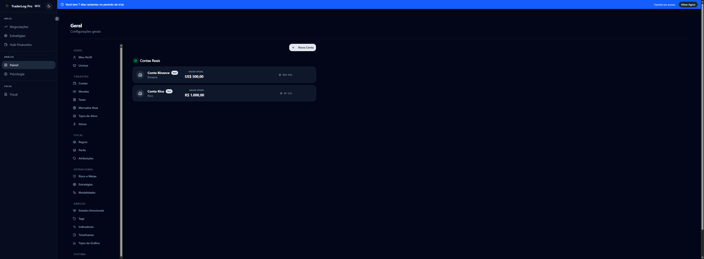

#### 2.2.2. Moedas
Gerencie moedas e taxas de câmbio contra sua moeda base.

**Como adicionar:**
1. Clique em **"Novo"**.
2. Defina o código (Ex: USD, EUR), nome e a taxa de conversão atual.
3. Clique em **"Salvar"**.

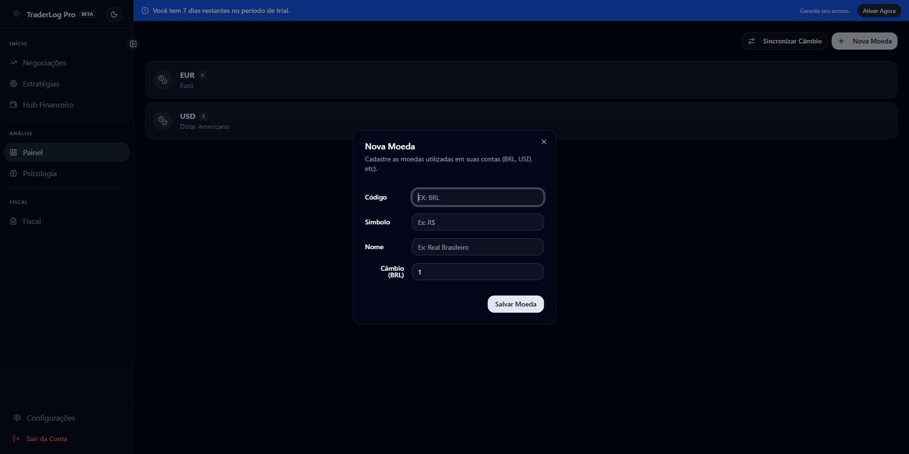

#### 2.2.3. Mercados
Defina fuso horário e janelas de pregão (B3, NYSE, etc).

**Como adicionar:**
1. Clique em **"Novo"**.
2. Informe o nome (Ex: B3), fuso horário e os horários de abertura e fechamento.
3. Clique em **"Salvar"**.

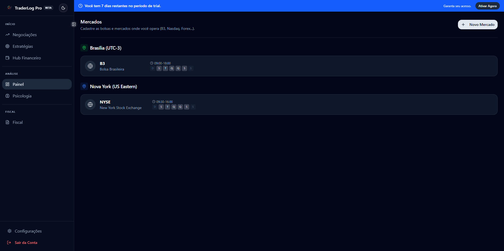
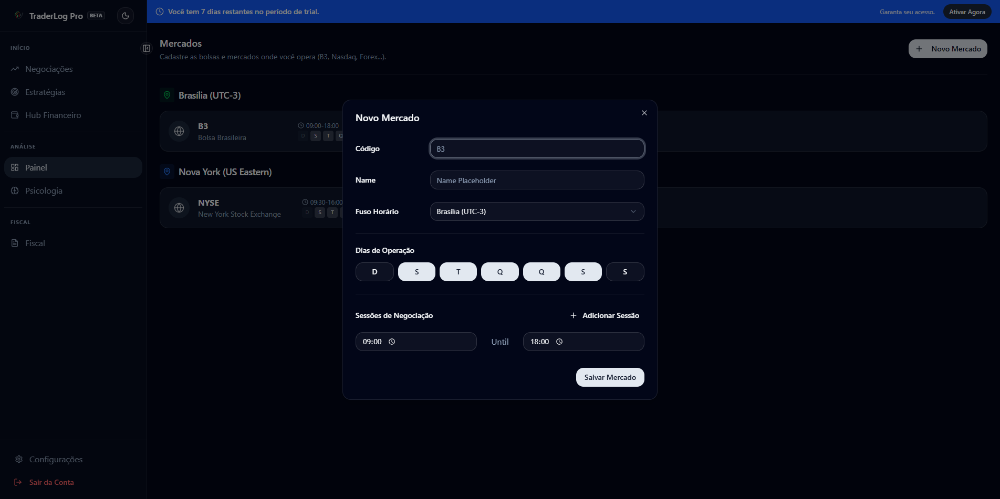

#### 2.2.4. Tipos de Ativos
Categorize os papéis e defina se o PnL será em financeiro ou pontos.

**Como adicionar:**
1. Clique em **"Novo Tipo"** no topo da lista.
2. Defina o nome (Ex: Ações, Índice), o mercado e como o resultado deve ser exibido (Financeiro ou Pontos).
3. Clique em **"Salvar"**.

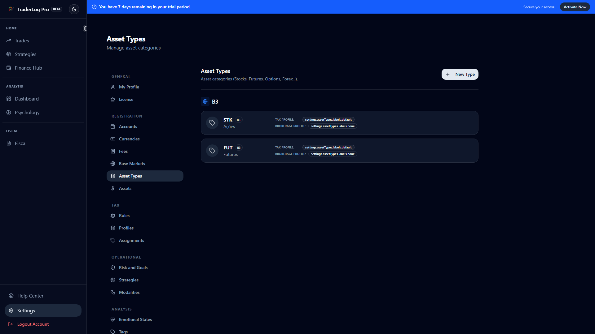

#### 2.2.5. Ativos
Cadastre tickers individuais (PETR4, WDO) e defina o peso do ponto.

**Como adicionar:**
1. Clique em **"Novo Ativo"** no topo da lista.
2. Informe o Símbolo (Ticker), Nome amigável e selecione o Tipo de Ativo.
3. Configure o Valor do Ponto (necessário para cálculo de PnL em contratos).
4. Clique em **"Salvar"**.

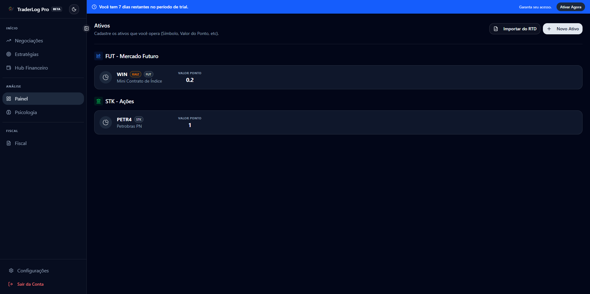
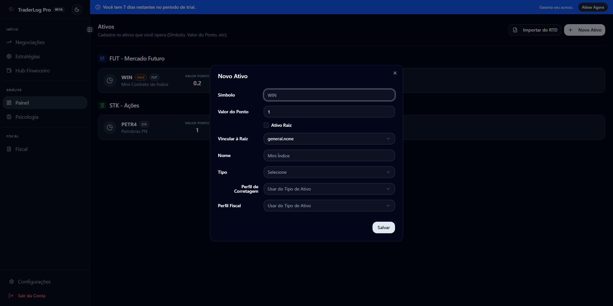

#### 2.2.6. Taxas & Emolumentos
Configure custos de corretagem e emolumentos da bolsa.

**Como adicionar:**
1. Clique em **"Nova Taxa"**.
2. Defina um nome para o perfil de taxas.
3. Informe os valores de corretagem (por ordem ou contrato) e as alíquotas de emolumentos e ISS.
4. Clique em **"Salvar"**.

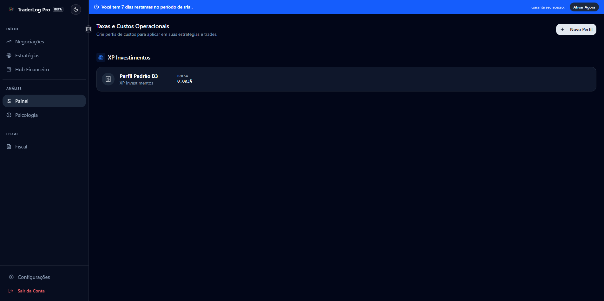

### 2.3. FISCAL

#### 2.3.1. Regras Fiscais
Defina alíquotas (Day Trade 20%, Swing 15%) e limites de isenção.

**Como adicionar:**
1. Clique em **"Nova Regra"**.
2. Escolha o Mercado e o Tipo de Ativo.
3. Defina as alíquotas de Day Trade e Swing Trade.
4. Informe o código de receita (DARF) e limites de isenção se houver.
5. Clique em **"Salvar"**.

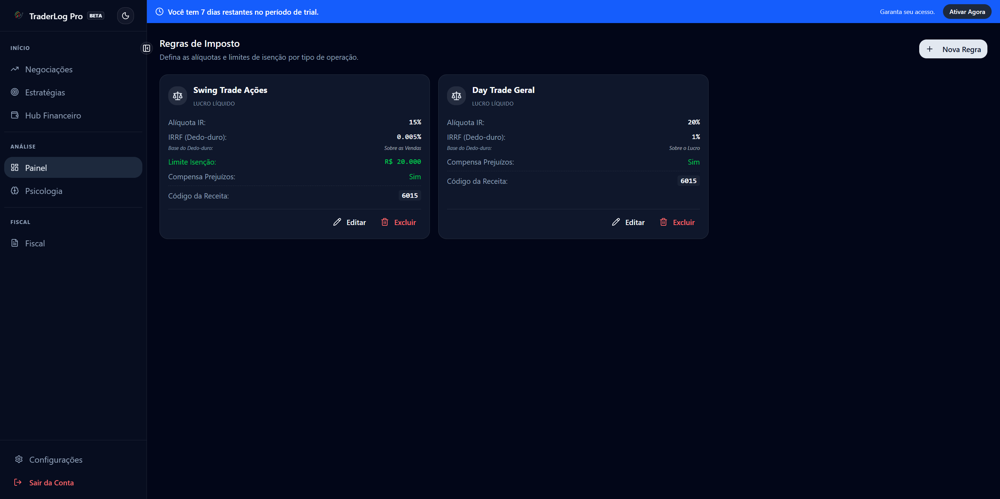

#### 2.3.2. Perfis Fiscais
Agrupe regras em perfis (Ex: "Padrão Brasil").

**Como adicionar:**
1. Clique em **"Novo Perfil"**.
2. Defina um nome (Ex: Swing Trade Ações).
3. Selecione as regras fiscais que compõem este perfil.
4. Clique em **"Salvar"**.

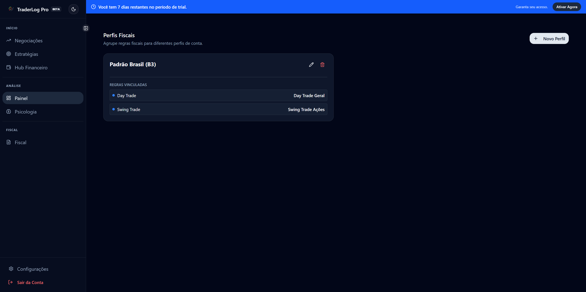

#### 2.3.3. Atribuições
Vincule perfis fiscais a contas ou tipos de ativos específicos.

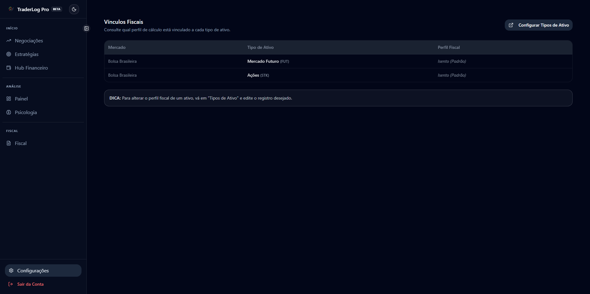

### 2.4. OPERACIONAL

#### 2.4.1. Perfil de Risco
Defina Stop Loss Diário, Metas e o **Growth Plan** (Plano de Crescimento) para proteger seu capital.

**Como adicionar:**
1. Clique em **"Novo Perfil"** na tela de Perfis de Risco.
2. No formulário, preencha as configurações divididas em três abas: Geral, Motor de Risco e Crescimento.
3. Clique em **"Salvar"** para aplicar as regras.

**Aba: Geral**  
Configurações básicas de limites e objetivos.

*   **Limite de Perda Diária:** Valor máximo que você aceita perder no dia. Ao atingir, a plataforma pode travar novas operações.
*   **Meta Diária:** Objetivo de ganho para o dia.
*   **Risco Máximo por Operação (%):** Limite de perda aceitável em uma única entrada.
*   **Quantidade Máxima de Trades:** Limite de operações por dia para evitar overtrading.
*   **Travar ao Atingir Perda:** Se ativado, impede a abertura de novas ordens após o stop diário.

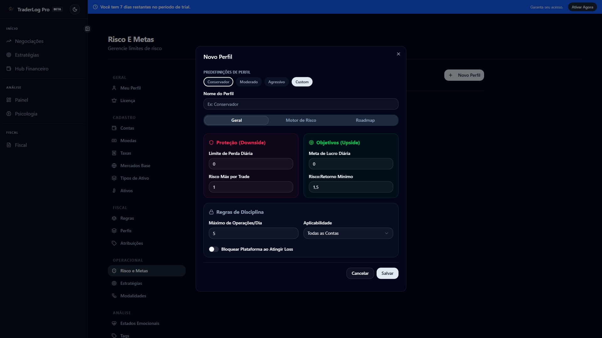

***

**Aba: Motor de Risco**  
Recursos avançados de inteligência e disciplina.

*   **Acoplamento Psicológico:** Reduz o tamanho da mão automaticamente se detectar uma sequência de perdas ou comportamento errático.
*   **Regressão de Outliers:** Identifica ganhos fora do comum que podem gerar excesso de confiança e ajusta o risco.
*   **Modo Sniper:** Aumenta a seletividade exigida para novas entradas com base no seu histórico.

***

**Aba: Plano de Crescimento**  
Escale seus lotes de forma matemática e segura.

*   **Habilitar Plano:** Ativa a progressão automática de lotes.
*   **Fases:** Defina quantos contratos/lotes operar em cada nível e quais as regras para subir ou descer de fase (Ex: 5 dias positivos para subir).

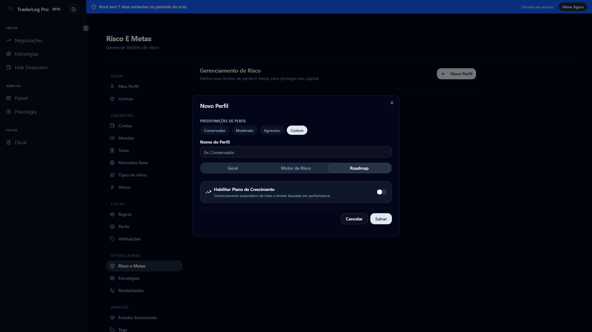

#### 2.4.2. Modalidades
Categorize o tempo das operações (Scalping, Swing, DT). **Vital para o cálculo fiscal.**

**Como adicionar:**
1. Clique em **"Nova Modalidade"**.
2. Informe o nome (Ex: Scalping, Day Trade).
3. Selecione o tipo de cálculo fiscal correspondente.
4. Clique em **"Salvar"**.

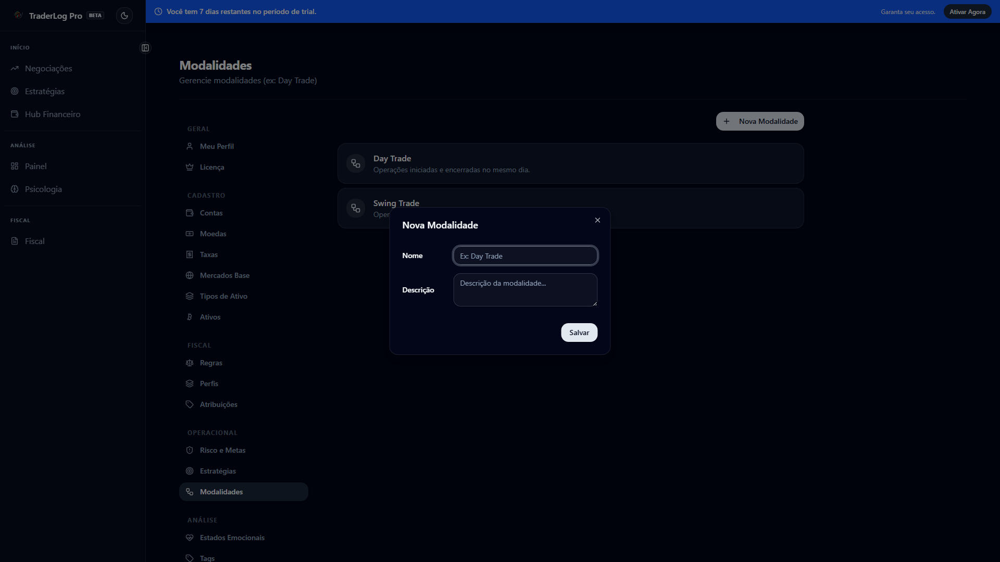

### 2.5. ANÁLISE

#### 2.5.1. Estados Emocionais
Mapeie seu humor (Foco, Ansiedade, Vingança) e o peso no seu resultado.

**Como adicionar:**
1. Clique em **"Novo Estado"**.
2. Dê um nome ao estado emocional.
3. Defina um ícone e o impacto (Positivo, Neutro ou Negativo).
4. Clique em **"Salvar"**.

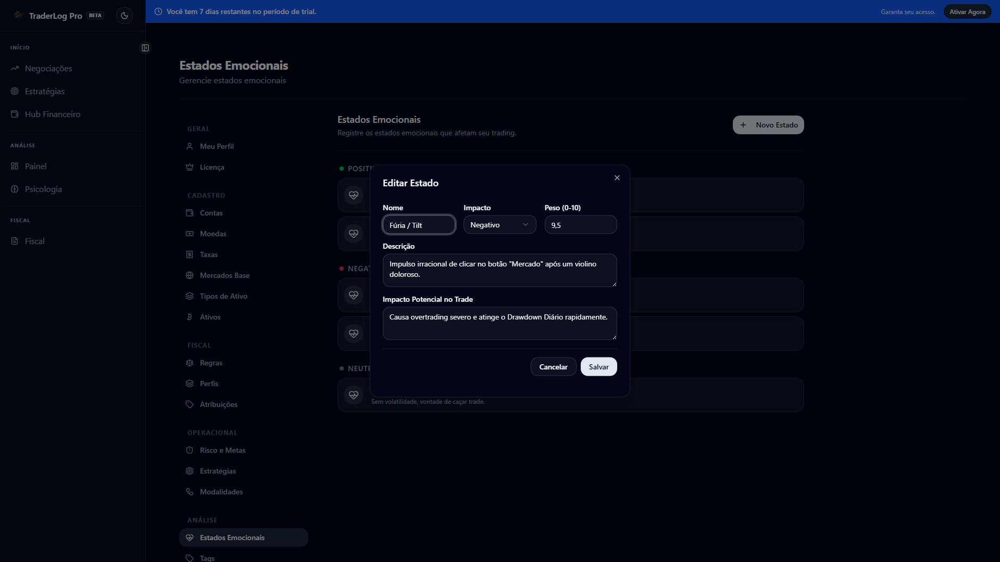

#### 2.5.2. Tags
Etiquetas livres para contexto (Notícia, Erro Operacional).

**Como adicionar:**
1. Clique em **"Nova Tag"**.
2. Informe o nome da tag.
3. Escolha uma cor para identificação visual.
4. Clique em **"Salvar"**.

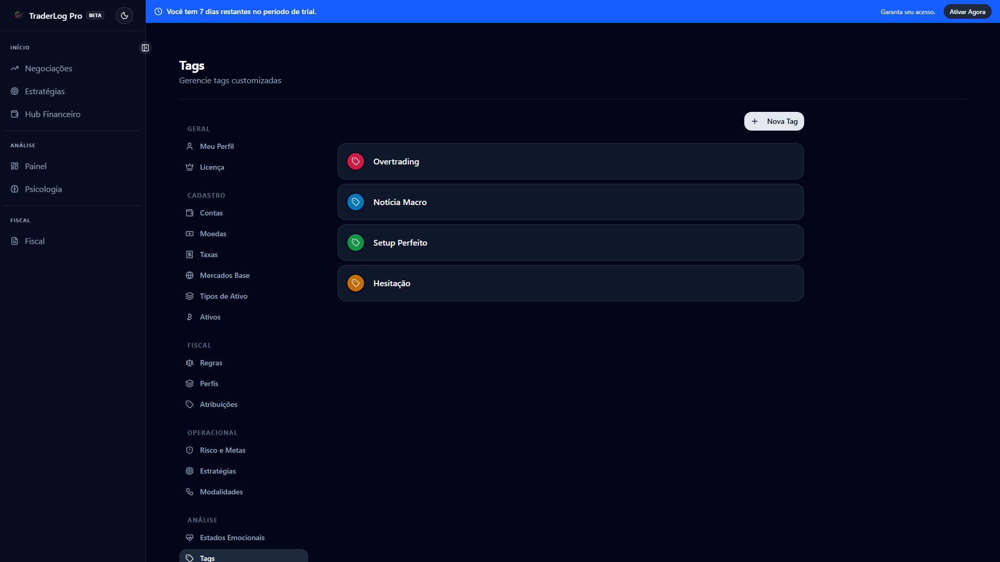

#### 2.5.3. Indicadores
Documente as ferramentas técnicas (VWAP, Médias) usadas nos setups.

**Como adicionar:**
1. Clique em **"Novo Indicador"**.
2. Nomeie o indicador técnico.
3. (Opcional) Adicione uma breve descrição técnica.
4. Clique em **"Salvar"**.

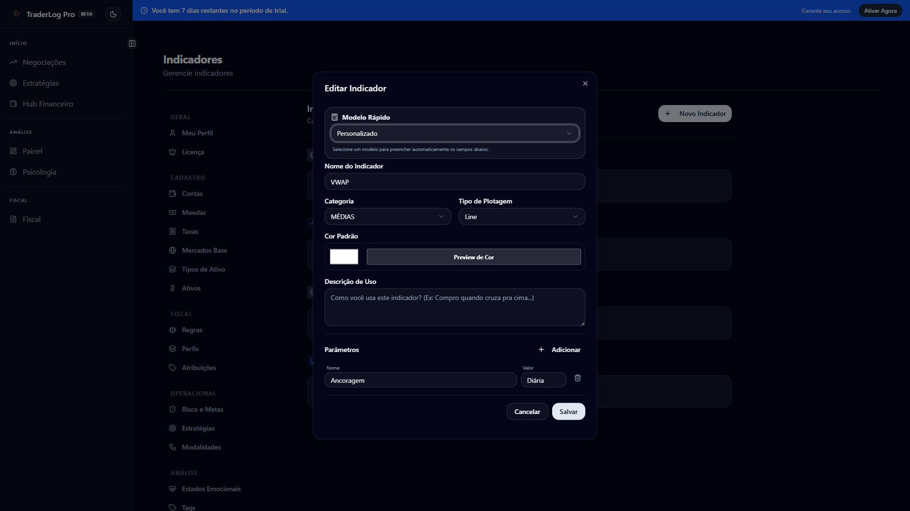

#### 2.5.4. Timeframes
Defina os tempos gráficos (1min, 5min, 60min).

**Como adicionar:**
1. Clique em **"Novo Timeframe"**.
2. Defina o valor numérico e a unidade (Minutos, Horas, Dias).
3. Clique em **"Salvar"**.

#### 2.5.5. Tipos de Gráfico
Escolha a forma de leitura de preço (Candle, Renko, Fluxo).

**Como adicionar:**
1. Clique em **"Novo Tipo"**.
2. Nomeie o estilo de gráfico (Ex: Renko 10R).
3. Clique em **"Salvar"**.

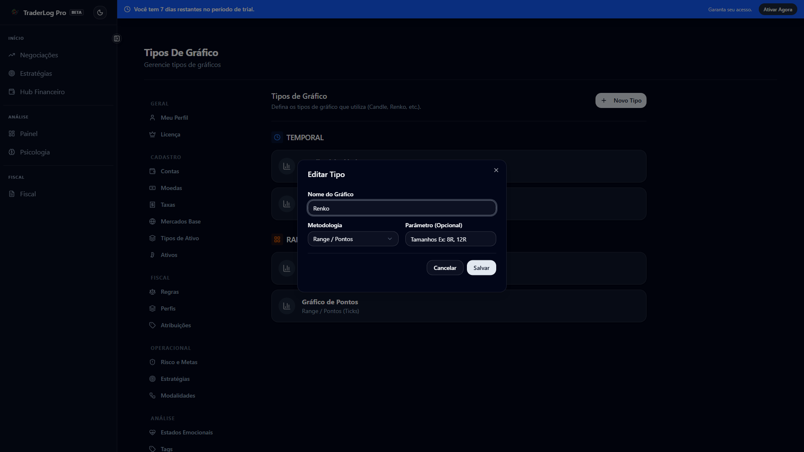

#### 2.5.6. Estratégias
Documente seus setups com gatilhos, checklists e exemplos visuais.

### 2.6. SISTEMA

#### 2.6.1. Integrações
Configure chaves de API para dados externos.
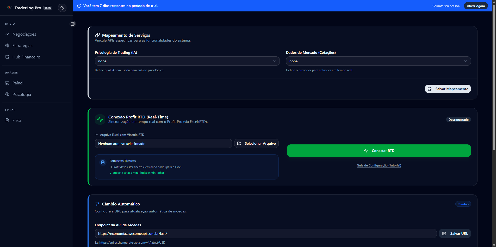

#### 2.6.2. Banco de Dados
Gestão e backup dos dados locais criptografados.
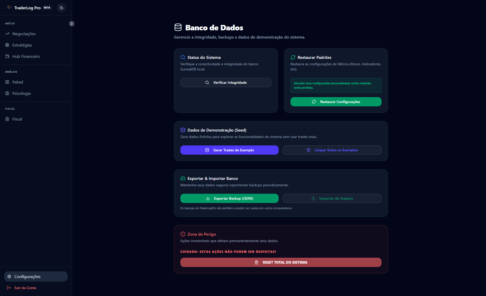

---

## 3. Navegação e Interface (O Cockpit)

### 3.1. Dashboard (Painel Principal)
Visão 360º da sua saúde financeira. Inclui Equity Curve, Calendário Semafórico e os 4 Kash Cards (Saldo, Net PnL, Win Rate e Disciplina).

### 3.2. Sidebar (Menu Lateral)
Navegação dividida entre Núcleo Operacional (Trades/Mente), Tesouraria (Bancos/Ativos), Malha Fina (Fiscal) e Casa de Máquinas (Configurações).

---

## 4. Ecossistema Operacional (Uso Diário)

### 4.1. Negociações (Trades)
A árvore cronológica onde o Auto-Journaling centraliza suas operações importadas via RTD.
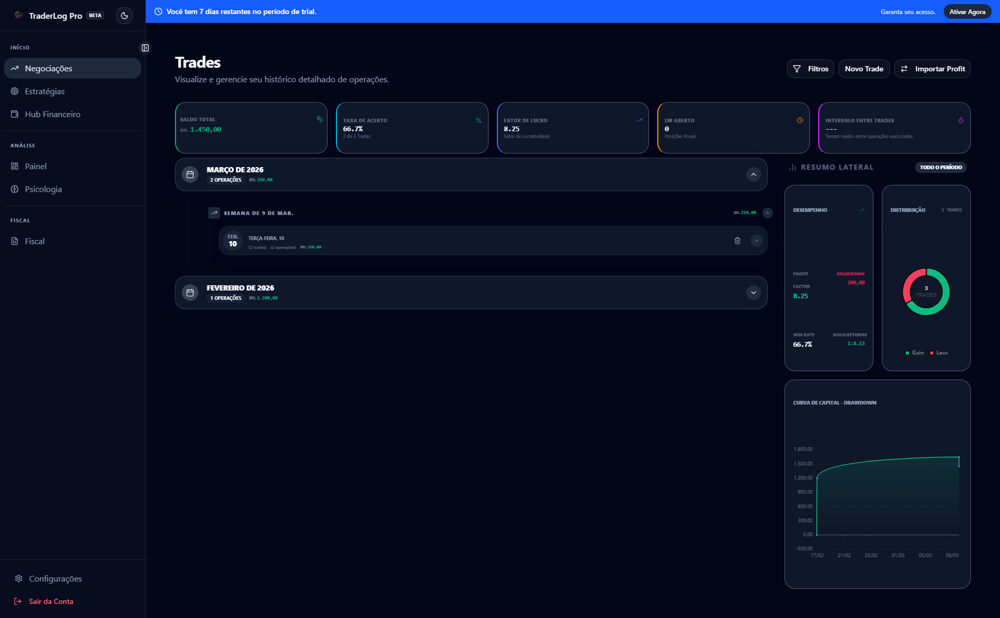

### 4.2. Estratégias Hub
Onde você analisa estatisticamente qual setup paga suas contas através de checklists de disciplina.
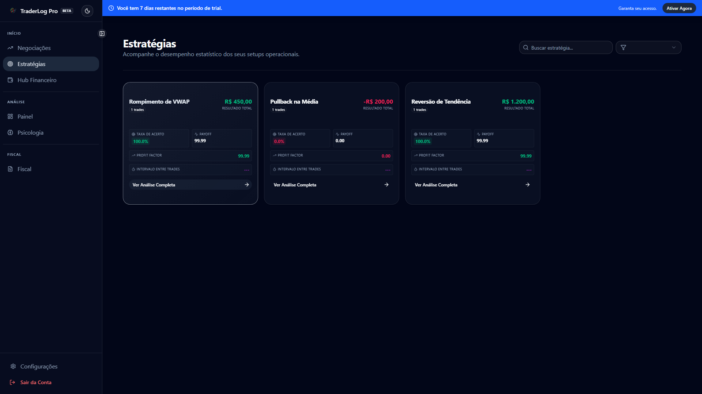

### 4.3. Hub Financeiro (Tesouraria)
Gestão de entradas, saídas e controle de margem entre bancos e corretoras.

### 4.4. Psicologia (Mente)
O cruzamento matemático entre seus estados emocionais e seu PnL real.

### 4.5. Fiscal (O Motor Fiscal B3)
Geração automática de DARFs, controle de isenção de 20k e relatórios mensais/anuais.

---
*(Fim do Manual - v1.1 - Padronizado)*
